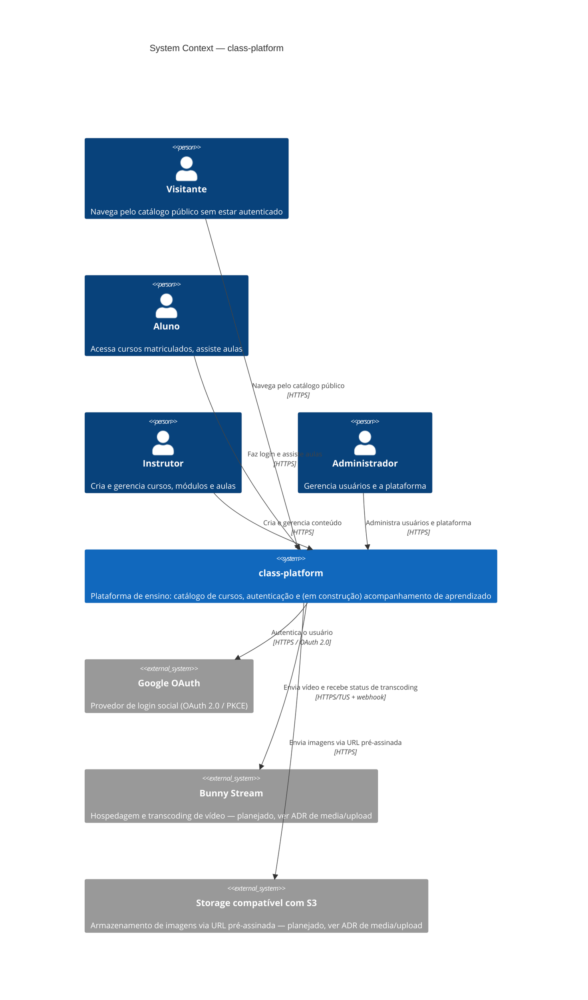
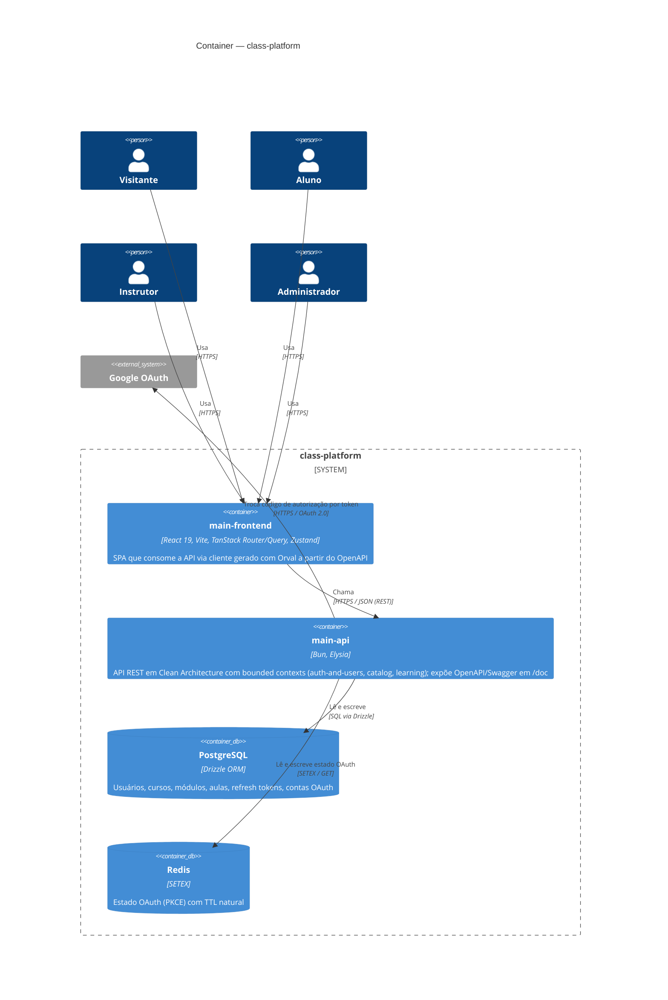

# Arquitetura — C4 Context e Container

Este documento cobre os dois primeiros níveis do [C4 Model](https://c4model.com/): o **System
Context** (quem usa o sistema e com o que ele conversa) e os **Containers** (as unidades
executáveis que compõem o sistema e como elas se comunicam). Os níveis Component e Code não são
usados aqui — os módulos internos do `main-api` ainda não têm complexidade que justifique o zoom
manual; ver [ADR 001](../../apps/main-api/docs/adr/001-clean-architecture-pragmatica-bounded-contexts.md)
para como esses módulos são organizados.

**Legenda de notação:** pessoas em azul escuro, o sistema em azul, sistemas/serviços externos em
cinza. Toda relação é rotulada com a ação e o protocolo — nunca só uma seta.

## Nível 1 — System Context

Bunny Stream e o storage de imagens aparecem com linha tracejada: são integrações **planejadas**
(decididas no ADR de media/upload do módulo `catalog`), ainda não implementadas no código.

## Nível 2 — Container

### Notas sobre o estado atual

- O módulo `learning` existe no código (`apps/main-api/src/modules/learning`) mas **ainda não
  está registrado no bootstrap** (`apps/main-api/src/bootstrap.ts` só chama
  `registerAuthModule` e `registerCatalogModule`). O diagrama mostra o container `main-api`
  como uma unidade só porque, no nível Container, os módulos internos não aparecem — mas vale
  saber que nem todo o código dentro dele está ligado ao runtime hoje.
- Redis já está em uso real (não é só uma proposta): `RedisOAuthStateRepository` é a
  implementação registrada em produção para o estado OAuth. Refresh tokens, por outro lado,
  ainda usam Postgres (`DrizzleRefreshTokenRepository`) — migrá-los para Redis é uma oportunidade
  identificada mas não decidida (sem ADR ainda).
