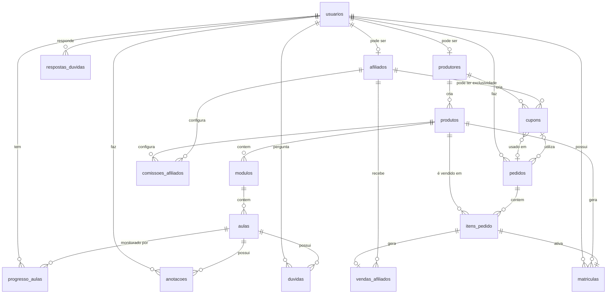

# Modelagem dividida em domínios para facilitar o entendimento.

### 1. Domínio de Usuários e Perfis
A base do sistema. Uma plataforma como Hotmart ou Kiwify geralmente tem dois papéis principais: **Produtor** (criador) e **Aluno** (comprador). Muitas vezes, uma mesma pessoa pode ser ambos.

**Tabela: `usuarios`**
*   `id` (UUID ou SERIAL) - **PK**
*   `nome_completo` (VARCHAR)
*   `email` (VARCHAR) - **Unique Index**
*   `senha_hash` (VARCHAR) - Para armazenar hash da senha
*   `cpf_cnpj` (VARCHAR) - Opcional, para questões fiscais
*   `avatar_url` (TEXT) - Link para a foto
*   `data_cadastro` (TIMESTAMP)
*   `ultimo_acesso` (TIMESTAMP)
*   `status` (ENUM: 'ativo', 'bloqueado', 'pendente')

**Tabela: `produtores`** (Estende o usuário com dados específicos de quem vende)
*   `id` (UUID) - **PK** e **FK** para `usuarios.id`
*   `bio` (TEXT)
*   `url_personalizada` (VARCHAR) - Ex: https://escola.dominio/professor.joao
*   `comissao_padrao` (DECIMAL) - % padrão de comissão que a plataforma retém dele?
*   `chave_pix` (VARCHAR)
*   `conta_bancaria` (TEXT) - JSON com dados bancários
*   `status_verificacao` (ENUM: 'pendente', 'verificado', 'reprovado')

---

### 2. Domínio de Catálogo e Conteúdo
Aqui é onde mora o "produto". Em plataformas modernas, o conceito de produto é abstrato. Pode ser um curso, um ebook, uma assinatura, um webinar.

**Tabela: `produtos`** (O "esqueleto" do curso)
*   `id` (UUID) - **PK**
*   `produtor_id` (UUID) - **FK** para `produtores.id`
*   `tipo` (ENUM: 'curso', 'ebook', 'comunidade', 'mentoria', 'assinatura')
*   `titulo` (VARCHAR)
*   `subtitulo` (VARCHAR)
*   `descricao` (TEXT)
*   `imagem_capa_url` (TEXT)
*   `preco` (DECIMAL)
*   `preco_promocional` (DECIMAL)
*   `data_criacao` (TIMESTAMP)
*   `status` (ENUM: 'rascunho', 'publicado', 'arquivado')

**Tabela: `modulos`** (Divide o curso em partes, usado se tipo = 'curso')
*   `id` (UUID) - **PK**
*   `produto_id` (UUID) - **FK** para `produtos.id`
*   `ordem` (INTEGER) - Para ordenar os módulos (ex: 1, 2, 3)
*   `titulo` (VARCHAR)
*   `descricao` (TEXT)

**Tabela: `aulas`** (O conteúdo em si)
*   `id` (UUID) - **PK**
*   `modulo_id` (UUID) - **FK** para `modulos.id`
*   `ordem` (INTEGER)
*   `titulo` (VARCHAR)
*   `descricao` (TEXT)
*   `tipo_conteudo` (ENUM: 'video', 'texto', 'quiz', 'arquivo')
*   `conteudo` (TEXT) - Para textos longos ou HTML.
*   `conteudo_url` (TEXT) - Para link do vídeo (Vimeo, Youtube, AWS S3).
*   `duracao_segundos` (INTEGER) - Importante para analytics.
*   `pontuacao_quiz` (INT) - Se for um quiz, quantos pontos vale.

---

### 3. Domínio de Vendas e Transações
Gerencia a compra, o acesso e os pagamentos.

**Tabela: `pedidos`**
*   `id` (UUID) - **PK**
*   `usuario_id` (UUID) - **FK** para `usuarios.id` (Quem comprou)
*   `data_pedido` (TIMESTAMP)
*   `valor_total` (DECIMAL)
*   `desconto` (DECIMAL)
*   `cupom_id` (UUID) - **FK** para `cupons.id` (opcional)
*   `status` (ENUM: 'pendente', 'pago', 'cancelado', 'reembolsado')
*   `metodo_pagamento` (ENUM: 'cartao', 'pix', 'boleto')

**Tabela: `itens_pedido`** (Liga o pedido aos produtos, pois um pedido pode ter mais de um curso)
*   `id` (UUID) - **PK**
*   `pedido_id` (UUID) - **FK** para `pedidos.id`
*   `produto_id` (UUID) - **FK** para `produtos.id`
*   `preco_unitario` (DECIMAL)
*   `comissao_aplicada` (DECIMAL) - Quanto o produtor ganhou nessa venda.

**Tabela: `matriculas`** (Corresponde à "Liberação de Acesso")
*   `id` (UUID) - **PK**
*   `usuario_id` (UUID) - **FK** para `usuarios.id` (Aluno)
*   `produto_id` (UUID) - **FK** para `produtos.id`
*   `data_aquisicao` (TIMESTAMP)
*   `data_expiracao` (TIMESTAMP) - NULL se for vitalício.
*   `status` (ENUM: 'ativo', 'expirado', 'cancelado')
*   `progresso_percentual` (INTEGER) - Cache para evitar calcular toda hora.

---

### 4. Domínio de Interação e Consumo
Aqui é o coração da experiência do aluno.

**Tabela: `progresso_aulas`**
*   `id` (UUID) - **PK**
*   `usuario_id` (UUID) - **FK**
*   `aula_id` (UUID) - **FK**
*   `status` (ENUM: 'nao_iniciado', 'assistindo', 'concluido')
*   `ultimo_segundo_assistido` (INTEGER)
*   `data_ultimo_acesso` (TIMESTAMP)
*   `concluido_em` (TIMESTAMP)
*   **Unique Index:** (`usuario_id`, `aula_id`) - Para garantir que não haja duplicidade.

**Tabela: `anotacoes`**
*   `id` (UUID) - **PK**
*   `usuario_id` (UUID) - **FK**
*   `aula_id` (UUID) - **FK**
*   `texto` (TEXT)
*   `timestamp_video` (INTEGER) - Em que minuto da aula ele fez a anotação.
*   `data_criacao` (TIMESTAMP)

**Tabela: `duvidas`** (Fórum)
*   `id` (UUID) - **PK**
*   `usuario_id` (UUID) - **FK** (Quem perguntou)
*   `aula_id` (UUID) - **FK** (Dúvida vinculada a uma aula específica)
*   `titulo` (VARCHAR)
*   `descricao` (TEXT)
*   `data_criacao` (TIMESTAMP)
*   `status` (ENUM: 'aberto', 'respondido', 'resolvido')

**Tabela: `respostas_duvidas`**
*   `id` (UUID) - **PK**
*   `duvida_id` (UUID) - **FK**
*   `usuario_id` (UUID) - **FK** (Quem respondeu: pode ser aluno ou produtor)
*   `texto` (TEXT)
*   `data_criacao` (TIMESTAMP)
*   `resposta_oficial` (BOOLEAN) - Para destacar a resposta do professor.

---

### 5. Domínio de Marketing (Afiliados e Cupons)
Essencial em plataformas como Hotmart.

**Tabela: `afiliados`**
*   `id` (UUID) - **PK** e **FK** para `usuarios.id`
*   `codigo_indicacao` (VARCHAR) - Ex: `@joao123`
*   `data_cadastro` (TIMESTAMP)

**Tabela: `comissoes_afiliados`** (Configuração: qual produto cada afiliado promove)
*   `id` (UUID) - **PK**
*   `afiliado_id` (UUID) - **FK** para `afiliados.id`
*   `produto_id` (UUID) - **FK** para `produtos.id`
*   `taxa_comissao` (DECIMAL) - % que o afiliado ganha nesse produto.
*   `status` (ENUM: 'ativo', 'bloqueado')

**Tabela: `vendas_afiliados`** (Registro de cada vaga atribuída a um afiliado)
*   `id` (UUID) - **PK**
*   `item_pedido_id` (UUID) - **FK** para `itens_pedido.id` (De qual venda veio)
*   `afiliado_id` (UUID) - **FK** para `afiliados.id`
*   `comissao_ganha` (DECIMAL) - Valor calculado.
*   `status_pagamento` (ENUM: 'a_pagar', 'pago', 'cancelado')

**Tabela: `cupons`**
*   `id` (UUID) - **PK**
*   `produtor_id` (UUID) - **FK** para `produtores.id`
*   `codigo` (VARCHAR) - Ex: `BLACKFRIDAY20`
*   `tipo_desconto` (ENUM: 'percentual', 'fixo')
*   `valor_desconto` (DECIMAL)
*   `data_inicio` (TIMESTAMP)
*   `data_fim` (TIMESTAMP)
*   `uso_maximo` (INTEGER) - Limite total de usos.
*   `afiliado_exclusivo_id` (UUID) - **FK** para `afiliados.id` (opcional, para cupons de afiliados).

---

### 6. Diagrama de Relacionamento (Mermaid)

Para visualizar como essas tabelas se conectam:

### Considerações Finais e Boas Práticas

1.  **Índices:** Não esqueça de criar índices nas colunas que são frequentemente usadas em buscas, como `email`, `produto_id`, `usuario_id`, e chaves estrangeiras.
2.  **Soft Delete:** Em vez de deletar registros, considere usar uma coluna `deleted_at` (TIMESTAMP) para manter o histórico.
3.  **Auditoria:** Plataformas de ensino lidam com dinheiro. É crucial ter tabelas de log para alterações em pedidos e pagamentos.
4.  **JSON fields:** Para dados esporádicos ou que mudam muito de formato (como configurações de checkout ou dados de webhook de pagamento), usar um campo `JSONB` (no PostgreSQL) pode ser uma boa prática para evitar muitas colunas esparsas.
5.  **Escalabilidade:** Em um volume muito grande, tabelas como `progresso_aulas` podem ser "shardeadas" por `usuario_id` ou movidas para um banco de dados NoSQL (como DynamoDB ou Cassandra) devido à alta taxa de escrita.

Este modelo cobre 80% das features de uma plataforma como Hotmart ou Kiwify. A partir daqui, você pode expandir para áreas como **comunidade (posts, likes)** ou **certificados**.